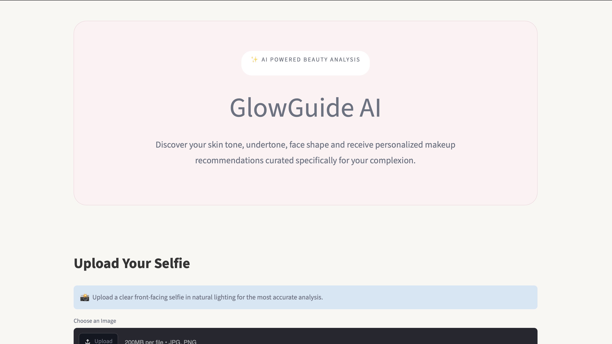
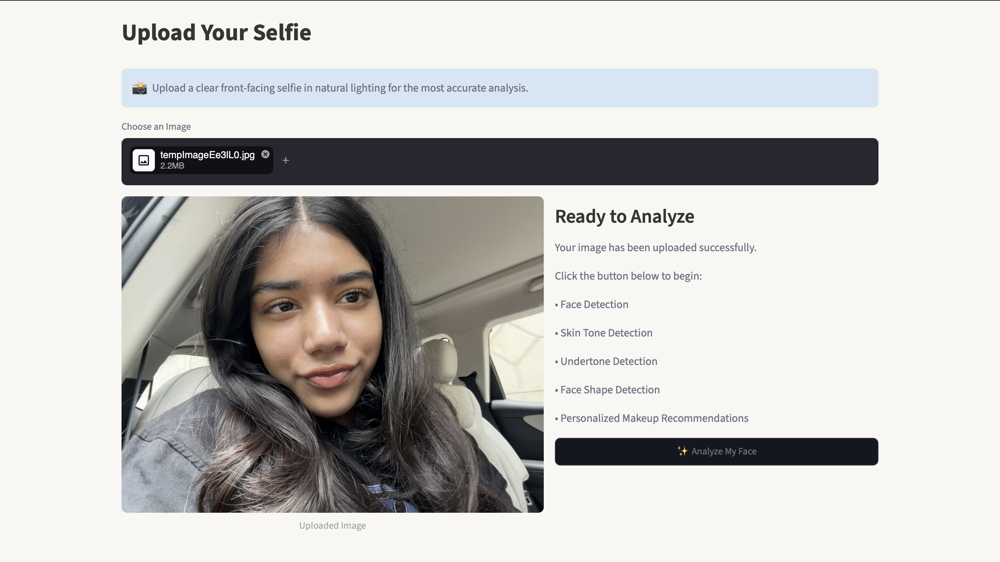
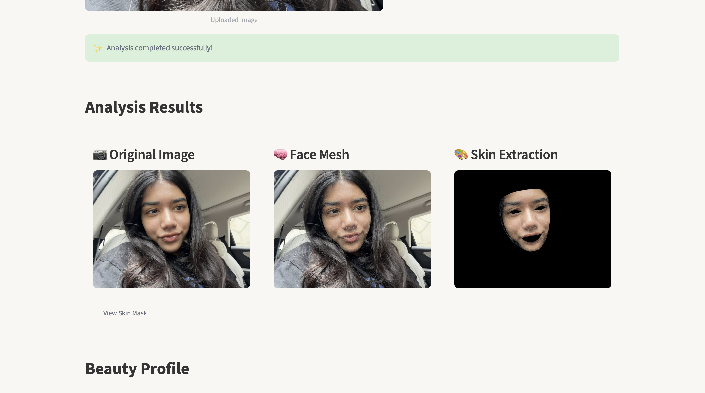
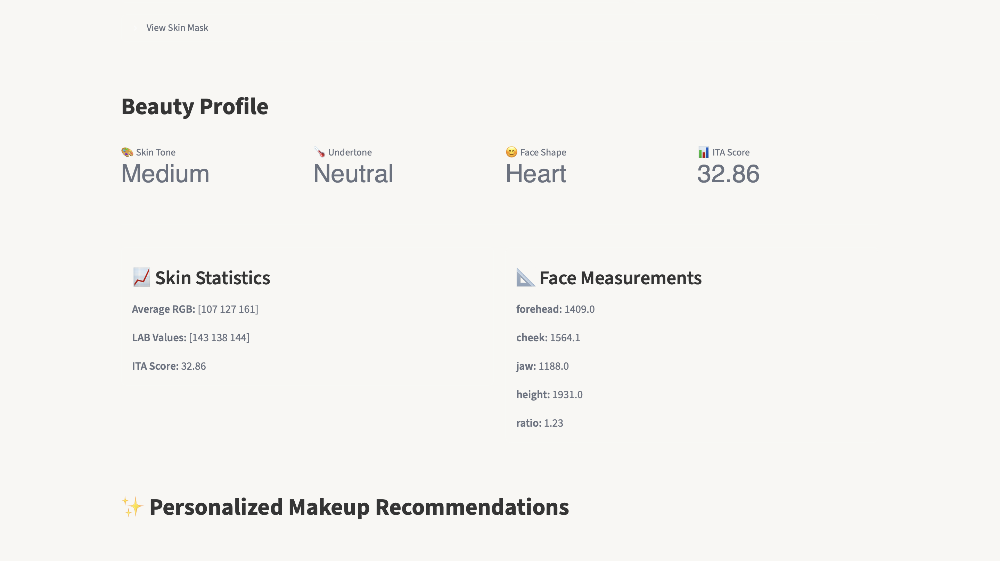
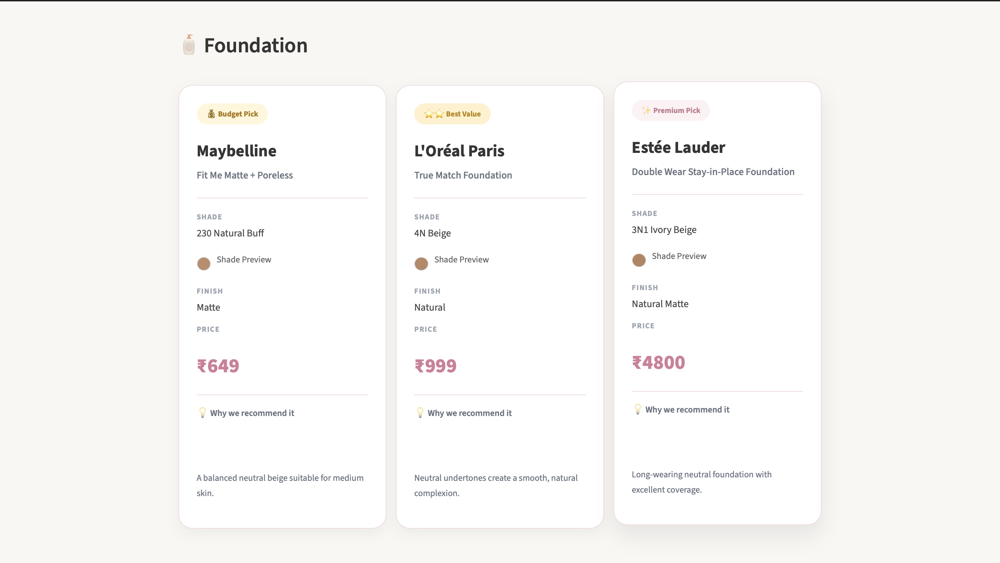
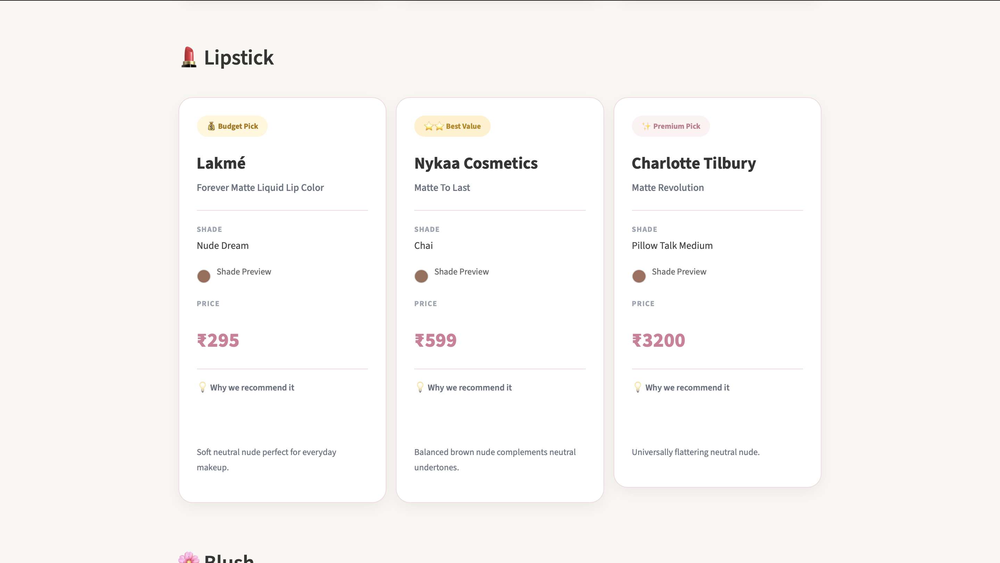
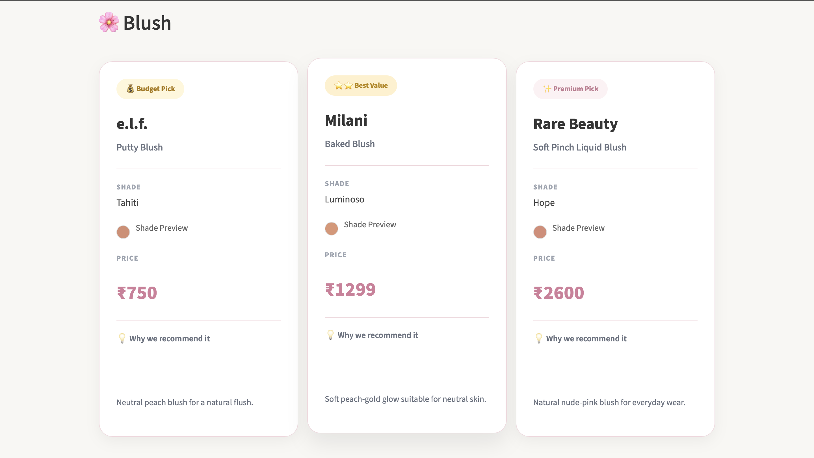
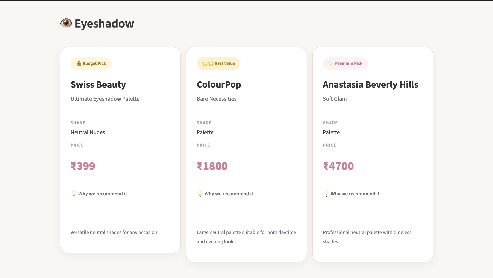

#  GlowGuide AI

An AI-powered beauty analysis web application that analyzes facial features, detects skin tone, undertone, and face shape, and recommends personalized makeup products based on the user's complexion.

---

##  Overview

GlowGuide AI uses Computer Vision and AI techniques to analyze a user's selfie and generate customized makeup recommendations. The application performs facial landmark detection, extracts skin information, determines the user's skin tone and undertone, predicts face shape, and suggests suitable makeup products across multiple price ranges.

This project combines image processing with an elegant user interface to provide an interactive beauty recommendation experience.

---

##  Features

- 📸 Upload a front-facing selfie
- 🧠 Face detection using MediaPipe Face Mesh
- 🎨 Automatic skin tone detection
- 🌈 Undertone detection using LAB color space
- 😊 Face shape analysis
- 💄 Personalized makeup recommendations
- 💰 Budget, Best Value and Premium product suggestions
- 🎀 Modern and responsive Streamlit interface

---

## 🖼️ Screenshots

### Landing Page



### Upload 



### Analysis



### Beauty Profile



### Personalized Recommendations






---

## 🛠️ Technology Stack

| Technology | Purpose |
|------------|----------|
| Python | Core Programming |
| Streamlit | Web Application |
| OpenCV | Image Processing |
| MediaPipe | Face Detection & Face Mesh |
| NumPy | Numerical Operations |
| Pandas | Product Database |
| scikit-image | Color Space Analysis |

---

## 📂 Project Structure

```text
GlowGuide-AI/
│
├── assets/
├── core/
├── recommendations/
├── app.py
├── requirements.txt
├── README.md
└── .gitignore
```

---

## ⚙️ Installation

Clone the repository

```bash
git clone https://github.com/aarushiisingh/GlowGuide-AI
```

Move into the project

```bash
cd GlowGuide-AI
```

Create a virtual environment

```bash
python -m venv venv
```

Activate the environment

### macOS/Linux

```bash
source venv/bin/activate
```

### Windows

```bash
venv\Scripts\activate
```

Install dependencies

```bash
pip install -r requirements.txt
```

Run the application

```bash
streamlit run app.py
```

---

##  How It Works

1. User uploads a selfie.
2. MediaPipe detects facial landmarks.
3. Skin pixels are extracted.
4. RGB values are converted to LAB color space.
5. ITA score is calculated.
6. Skin tone and undertone are identified.
7. Face shape is determined using facial measurements.
8. Personalized makeup products are recommended.

---

##  Future Improvements

- Virtual makeup try-on
- Skin concern detection
- Foundation shade matching
- Hairstyle recommendations
- Personalized skincare routine
- Product purchase links
- Mobile responsive interface

---

## 👩‍💻 Author

**Aarushi Singh**

B.Tech Electronics & Communication Engineering  
Jaypee Institute of Information Technology, Noida

Interested in Artificial Intelligence, Computer Vision, Machine Learning and Full Stack AI Applications.

---

## 📄 License

This project is licensed under the MIT License. See the [LICENSE](LICENSE) file for details.

⭐ If you like this project, consider giving it a star!